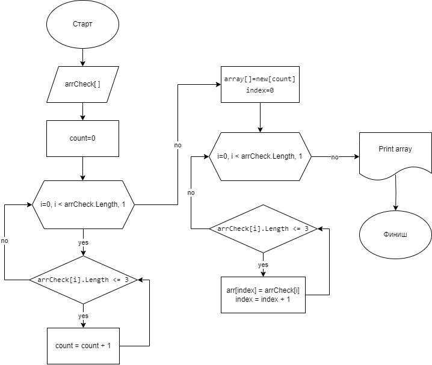

### Задача:
Написать программу, которая из имеющегося массива строк формирует новый массив из строк, длина которых меньше, либо равна 3 символам. Первоначальный массив можно ввести с клавиатуры, либо задать на старте выполнения алгоритма. При решении не рекомендуется пользоваться коллекциями, лучше обойтись исключительно массивами.

*Описание решения:*

1. Создаем массив из строк, введенных пользователем.

2. Создаем метод, который:

* производит подсчет количества элементов в массиве, длина которых меньше либо равна 3 символа,

* создает новый массив размером, равным количеству подсчитанных элементов,

* заполняет новый массив элементами, длина которых меньше либо равна 3 символа.

3. Выводим на печать исходный массив и новый массивы.

Блок-схема алгоритма

